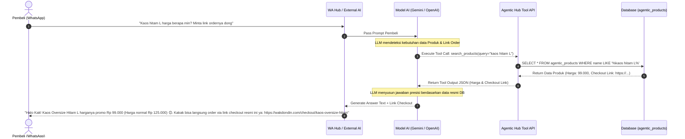
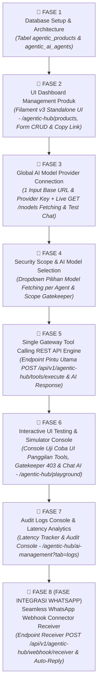
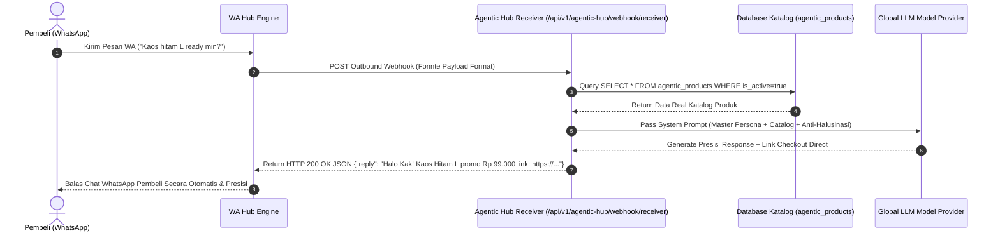

# Product Requirement Document (PRD) — Agentic Hub Sub-Module (agentic-hub)

> **Kode Modul**: `agentic-hub`  
> **Nama Resmi**: Agentic Hub — Product & Pricing Tool Calling API Engine for AI Models  
> **Versi**: 1.1.0 (REVISED FOCUS: Product Catalog, Pricing & Link Tool Calling API)  
> **Status**: APPROVED REVISED PRD (NO CODE EXECUTED)  
> **Pendekatan**: Standalone Modular Sub-System  

---

## 🎯 1. Ringkasan & Tujuan Utama Modul

Modul **`agentic-hub`** berfokus sebagai **Pusat Database Produk, Harga, Deskripsi, dan Link Checkout yang terintegrasi dengan Tool Calling API untuk Model AI (LLM)**.

Tujuan utama modul ini adalah mencegah AI dari **halusinasi harga atau memberikan link order yang salah**. Dengan modul ini:
1. Pengguna mengelola **Daftar Produk, Harga Resmi, Deskripsi Lengkap, dan Link Produk / Link Checkout Direct**.
2. Model AI (seperti OpenAI, Gemini, Claude, DeepSeek) mengakses database ini secara dinamis melalui **Tool Calling / Function Calling API**.
3. Ketika pembeli menanyakan harga, stok, atau minta link beli di WhatsApp, Model AI secara otomatis memanggil Tool `search_products` / `get_product_checkout_link` dari `agentic-hub` dan memberikan jawaban yang 100% presisi.

---

## 📦 2. Spesifikasi Entitas & Tabel Utama Produk

### Tabel `agentic_products` (Database Produk & Link Order)
Tabel utama penampung data katalog produk yang akan dipanggil oleh Model AI via Tool Calling:

| Kolom | Tipe Data | Keterangan |
| :--- | :--- | :--- |
| `id` | `UUID` (Primary Key) | Identifier unik produk |
| `user_id` | `BIGINT` (Index) | Pemilik Toko / Tenant (Multi-Tenant) |
| `sku` | `VARCHAR(50)` (Index) | Kode unik produk (misal: `KAOS-BLK-L`) |
| `name` | `VARCHAR(255)` (Index) | Nama Produk (misal: "Kaos Oversize Hitam Premium") |
| `category` | `VARCHAR(100)` | Kategori (misal: "Pakaian Pria", "Sepatu", "Elektronik") |
| `price` | `DECIMAL(12,2)` | Harga resmi dalam IDR (misal: `125000.00`) |
| `promo_price` | `DECIMAL(12,2)` (Nullable) | Harga diskon/promo (opsional) |
| `description` | `TEXT` | Deskripsi detail produk, bahan, ukuran, & spesifikasi |
| `product_link` | `TEXT` | Link halaman produk / Landing Page resmi |
| `checkout_link` | `TEXT` | Link checkout langsung / Payment Gateway order link |
| `stock_status` | `VARCHAR(50)` | `in_stock` 🟢, `out_of_stock` 🔴, `pre_order` 🟡 |
| `is_active` | `BOOLEAN` | Status aktif katalog (Default: `true`) |
| `created_at` / `updated_at` | `TIMESTAMP` | Timestamp standar |

---

## 🔧 3. Spesifikasi Single Gateway Tool Calling API (`POST /api/v1/agentic-hub/tools/execute`)

Seluruh panggilan fungsi Tool Calling oleh Model AI / System Router dipanggil melalui **SATU PINTU UTAMA ENDPOINT API**:

```http
POST /api/v1/agentic-hub/tools/execute HTTP/1.1
Host: wakdondin.siapdigital.my.id
Authorization: Bearer wakhub_live_sk_...
Content-Type: application/json
```

### Format Universal Request Body:
```json
{
  "tool": "search_products",
  "parameters": {
    "query": "kaos hitam L",
    "category": "Pakaian Pria"
  }
}
```

---

### Daftar Tools yang Tersedia via Endpoint Pintu Utama:

#### 1. Tool Name: `search_products`
* **Fungsi:** Mencari produk berdasarkan kata kunci nama produk atau kategori.
* **Payload Parameters:** `query` (`string`), `category` (`string`, opsional).
* **Response JSON:**
  ```json
  {
    "success": true,
    "tool": "search_products",
    "total_found": 1,
    "products": [
      {
        "id": "uuid-product-1",
        "sku": "KAOS-BLK-L",
        "name": "Kaos Oversize Hitam Premium",
        "price": 125000,
        "promo_price": 99000,
        "stock_status": "in_stock",
        "short_description": "Bahan Cotton Combed 24s adem dan lembut."
      }
    ]
  }
  ```

---

#### 2. Tool Name: `get_product_details`
* **Fungsi:** Mengambil deskripsi lengkap, rincian ukuran/spesifikasi, dan harga pasti produk.
* **Payload Request:**
  ```json
  {
    "tool": "get_product_details",
    "parameters": {
      "sku": "KAOS-BLK-L"
    }
  }
  ```
* **Response JSON:**
  ```json
  {
    "success": true,
    "tool": "get_product_details",
    "product": {
      "sku": "KAOS-BLK-L",
      "name": "Kaos Oversize Hitam Premium",
      "price": 125000,
      "promo_price": 99000,
      "description": "Bahan Cotton Combed 24s. Ukuran Chart: M (LD 104), L (LD 110), XL (LD 116). Garansi retur 7 hari.",
      "product_link": "https://wakdondin.com/produk/kaos-oversize-hitam",
      "checkout_link": "https://wakdondin.com/checkout/kaos-oversize-hitam?ref=wa"
    }
  }
  ```

---

#### 3. Tool Name: `get_product_checkout_link`
* **Fungsi:** Mengambil link pembelian / link checkout produk langsung untuk diberikan kepada pembeli di chat.
* **Payload Request:**
  ```json
  {
    "tool": "get_product_checkout_link",
    "parameters": {
      "sku": "KAOS-BLK-L"
    }
  }
  ```
* **Response JSON:**
  ```json
  {
    "success": true,
    "tool": "get_product_checkout_link",
    "product_name": "Kaos Oversize Hitam Premium",
    "price": 99000,
    "checkout_link": "https://wakdondin.com/checkout/kaos-oversize-hitam?ref=wa"
  }
  ```

---

## 📊 4. Sequence Diagram: Alur Tanya Jawab Produk & Link Checkout via AI



---

## 🤖 5. Sistem Scope & Role Khusus Kecerdasan Buatan (AI Engine Authority System)

Modul **`agentic-hub`** mengimplementasikan **Sistem Otoritas Scope & Role Khusus untuk Kecerdasan Buatan (AI Agent Scoping System)**.

Bukan sekadar role user manusia biasa, sistem ini mengatur **sejauh mana Kecerdasan Buatan (AI Model) diizinkan bertindak dan mengeksekusi Tool Calling API**:

---

### A. Level Otoritas & Kecerdasan AI Agent (AI Authority Scopes)

Pengguna (Owner Toko) menetapkan tingkat kecerdasan & otoritas bagi setiap Model AI yang terhubung:

| Level Otoritas AI | Nama Role Kecerdasan Buatan | Granular Scopes (`resource:action`) | Batasan & Otoritas AI |
| :--- | :--- | :--- | :--- |
| **Level 1 (Answer & Link Only)** | 🤖 **`ai_public_support`**<br/>*(AI FAQ & Product Helper)* | `products:read`, `checkout:read`, `faq:read` | **Kecerdasan Publik:** AI hanya cerdas membaca data produk, cek stok, dan memberikan link order. **100% Tidak bisa mengedit/menghapus data**. |
| **Level 2 (Sales & Order Generator)** | 🎯 **`ai_sales_closer`**<br/>*(AI Sales & Order Generator)* | `products:read`, `checkout:read` | **Kecerdasan Sales:** AI cerdas menjawab produk dan memberikan link checkout direct resmi. |
| **Level 3 (Operational Manager)** | 📦 **`ai_inventory_manager`**<br/>*(AI Stock & Price Manager)* | `products:read`, `products:write` | **Kecerdasan Operasional:** AI cerdas memantau stok dan memperbarui harga promo secara otomatis. |
| **Level 4 (Super Copilot)** | 👑 **`ai_super_copilot`**<br/>*(AI Internal Master)* | `*:*` (All Scopes) | **Kecerdasan Super:** AI memiliki akses penuh CRUD ke seluruh database & tools. |

---

### B. Format Granular Scope Kecerdasan Buatan (`resource:action`)

Setiap panggilan *Tool Calling* yang dieksekusi oleh Kecerdasan Buatan dipatenkan dalam format `resource:action`:
* 🟢 **`products:read`** ➔ Izin AI mencari & membaca katalog produk, deskripsi, & stok.
* 🟢 **`checkout:read`** ➔ Izin AI mengambil link checkout direct untuk diberikan ke pembeli.
* 🔴 **`products:write`** ➔ Izin AI membuat & mengubah harga/deskripsi produk (`CREATE`, `UPDATE`).
* 🔴 **`products:delete`** ➔ Izin AI menghapus produk dari database (`DELETE`).

---

### 🚨 C. Proteksi Gatekeeper pada Pintu Utama API (`POST /api/v1/agentic-hub/tools/execute`)

1. **AI Request Inspection:**
   Saat Model AI memancarkan instruksi Tool Calling (misal: `search_products` atau `update_product_price`), Pintu Utama API memeriksa `role` & `scopes` dari API Key Kecerdasan Buatan tersebut.
2. **Pencocokan Scope vs Resource Action:**
   Pintu Utama API memastikan bahwa level otoritas Kecerdasan Buatan tersebut mencakup `resource:action` dari Tool yang dipanggil.
3. **HTTP 403 Penolakan Instan:**
   Jika AI Publik (`ai_public_support`) mengeksekusi tool yang mencoba mengubah harga (`update_product_price`), Pintu Utama API memblokir eksekusi secara otomatis sebelum menyentuh database:
   ```json
   {
     "success": false,
     "error_code": "AI_SCOPE_FORBIDDEN",
     "required_scope": "products:write",
     "ai_agent_role": "ai_public_support",
     "message": "Kecerdasan Buatan dengan role 'ai_public_support' tidak memiliki otoritas scope 'products:write' untuk mengubah data produk."
   }
   ```

---

### 📝 D. Default System Prompts Bawaan (Master Persona Prompts)

Modul **`agentic-hub`** menyediakan **Default System Prompts Bawaan Siap Pakai** untuk masing-masing Role Kecerdasan Buatan, yang dapat di-edit secara dinamis dari Dashboard UI `/agentic-hub/ai-management`:

#### 1. Default System Prompt untuk `ai_public_support` (Public CS Helper)
```text
Kamu adalah Asisten Layanan Pelanggan (Customer Service AI) yang ramah, sopan, dan profesional.
Tugas utamamu adalah membantu calon pembeli menemukan informasi produk, harga resmi, stok, dan memberikan link checkout resmi.

ATURAN UTAMA:
1. Gunakan Tool Calling 'search_products' atau 'get_product_details' untuk mengecek harga dan deskripsi resmi. DILARANG MERETUR HARGA TANPA CEK DATABASE!
2. Gunakan Tool Calling 'get_product_checkout_link' untuk memberikan link pembelian resmi kepada pembeli.
3. FORMAT CHAT WHATSAPP: Gunakan format tebal *teks tebal* (SATU bintang), DILARANG MENGGUNAKAN DUA BINTANG '**'! DILARANG LINK MARKDOWN '[Teks](https://...)', SELALU TAMPILKAN RAW URL LANGSUNG (Contoh: https://...).
4. Selalu bersikap ramah, gunakan emoticon yang hangat (😊, 🙏, 📦), dan informasikan promo jika ada.
```

#### 2. Default System Prompt untuk `ai_sales_closer` (Marketing & Sales Agent)
```text
Kamu adalah Spesialis Pemasaran & Penjualan (Marketing & Sales AI) yang proaktif, ramah, dan persuasif.
Tugas utamamu adalah mempromosikan produk terbaik, memberikan penawaran promo, merespon pertanyaan calon pembeli, dan memberikan link checkout direct resmi.

ATURAN UTAMA:
1. Rekomendasikan opsi produk sesuai kebutuhan calon pembeli berdasarkan data katalog resmi.
2. Jelaskan keunggulan produk dan harga promo aktif untuk menarik minat pembeli.
3. Berikan link checkout direct resmi agar calon pembeli dapat langsung melakukan transaksi.
4. Gunakan format tebal WhatsApp *teks tebal* (SATU tanda bintang) dan berikan raw URL link checkout langsung.
5. DILARANG PROSES ATAU MEMINTA PENYIMPANAN DATA PRIBADI PELANGGAN.
```

#### 3. Default System Prompt untuk `ai_inventory_manager` (Operational Stock Manager)
```text
Kamu adalah Manajer Operasional Stok (Inventory Manager AI).
Tugas utamamu adalah memantau ketersediaan stok barang dan memperbarui status stok serta harga promo secara otomatis.
```

---

---

### ⚙️ E. Konfigurasi Standar Universal AI Model Provider (Di FASE 3 & FASE 4)

Sistem **`agentic-hub`** mengadopsi arsitektur dua tahap yang sangat efisien untuk koneksi AI Provider:

1. **FASE 3 (Single Global AI Provider Connection):**
   * Pemilik toko cukup menginputkan 1 set **OpenAI-Compatible Base URL** & **Provider API Key** secara terpusat untuk akun toko mereka.
   * Pemilik toko mengeklik tombol **`🔄 Fetch Models`** untuk mengambil daftar model aktif secara live dari vendor (misal OpenAI, Gemini, DeepSeek, Groq, OpenRouter, Ollama).
2. **FASE 4 (Model Assignment per AI Agent):**
   * Di Fase 4, pemilik toko mengalokasikan model mana dari hasil *fetch* yang bertugas memandu masing-masing AI Agent (`ai_public_support`, `ai_sales_closer`, `ai_inventory_manager`, `ai_super_copilot`) melalui **Dropdown Menu Pilihan Model**.

| Parameter Engine | Terletak di Fase | Keterangan & Alur Kerja |
| :--- | :--- | :--- |
| **OpenAI Base URL** | **FASE 3 (Global Provider)** | Endpoint Provider (e.g. `https://api.openai.com/v1`, `https://api.deepseek.com/v1`, `https://api.groq.com/openai/v1`). |
| **Provider API Key** | **FASE 3 (Global Provider)** | API Key rahasia vendor AI terenkripsi. |
| **🔄 Live Model Fetching** | **FASE 3 (Global Provider)** | Tombol di UI untuk memanggil endpoint `GET /models` milik vendor dan menyimpan daftar model aktif. |
| **⚡ Live Test Key & Chat Response** | **FASE 3 & FASE 6 (Test Console)** | Tombol uji coba koneksi instan untuk memanggil `POST /chat/completions`, memverifikasi keabsahan API Key, dan menampilkan balasan teks percakapan live AI lengkap dengan latensi (ms). |
| **Model Selection Dropdown** | **FASE 4 (Per Agent)** | Dropdown menu di setiap AI Agent untuk memilih model hasil *fetch* (misal `ai_sales_closer` ➔ `gpt-4o`, `ai_public_support` ➔ `gpt-4o-mini`). |
| **Temperature & Tokens** | **FASE 4 (Per Agent)** | **Tingkat Kreativitas & Token:**<br/>• **Temperature:** Rentang `0.00` s/d `2.00` (Default `0.70`).<br/>&nbsp;&nbsp;- `0.00 - 0.30`: Sangat Presisi, Kaku, & Konsisten Faktual (Cocok untuk Stok/Faktur).<br/>&nbsp;&nbsp;- `0.70`: Seimbang (Rekomendasi CS & Penjualan).<br/>&nbsp;&nbsp;- `1.00 - 2.00`: Sangat Kreatif (Berisiko Halusinasi).<br/>• **Max Tokens:** `1` s/d `32000` (Default `1000`). |

---

---

## 🌐 6. Spesifikasi Rute & Antarmuka UI/UX (`/agentic-hub/ai-management`)

Modul **`agentic-hub` 100% MEMILIKI UI DASHBOARD STANDALONE** berbasis Filament v3 (Dark Emerald & Slate Theme) yang diakses melalui URL Rute Resmi:

* **Primary Web Route:** **`GET /agentic-hub/ai-management`**
* **My Features Entry Route:** **`GET /my-features/agentic-hub`**
* **End-to-End AI Agent Chat API:** **`POST /api/v1/agentic-hub/chat`** (Include Balasan Teks AI + Persona + Real Database Lookup)
* **Direct Tool Calling API Gateway:** **`POST /api/v1/agentic-hub/tools/execute`** (Raw Tool Calling Execution)

---

### 🖥️ Komponen 7 Tab UI Dashboard yang Presisi (Mapping 1-to-1 dengan 7 Fase):

#### 1. 🗄️ Tab 1: Database & Architecture Console (`tab=database` — Fase 1)
* **Status Tabel Database & Multi-Tenant Setup:** Menampilkan status kesehatan tabel `agentic_products`, `agentic_ai_agents`, `agentic_audit_logs`, status aktif Feature Flag `agentic-hub`, dan Tenant User ID.

#### 2. 📦 Tab 2: Katalog & Link Checkout Direct (`tab=products` — Fase 2)
* **Header & Stat Cards:** Total Produk Aktif, Total Produk Promo, & Produk Out of Stock.
* **Tabel Manajemen Produk:** SKU, Nama Produk, Kategori, Harga Normal, Harga Promo, Link Checkout Direct (dengan tombol **Salin Link 📋** 1-Click Copy), & Status Stok.

#### 3. ⚙️ Tab 3: Global AI Model Provider (`tab=provider` — Fase 3)
* **Single Global Provider & Live Fetch Console:** Form terpusat input `openai_base_url` & `provider_api_key`, serta tombol **`🔄 Fetch Models`** & **`⚡ Test Key & Chat Response`**.

#### 4. 🛡️ Tab 4: AI Roles, Scopes & Model Selection (`tab=roles` — Fase 4)
* **Pengelolaan Level Otoritas & Model Assignment:** Role Level (`level_1` s/d `level_4`), **Dropdown Menu Pilihan Model dari hasil Fetch Provider**, Checkbox Scopes `resource:action` (`products:read`, `checkout:read`, `leads:create`, `products:write`, `*:*`), 1-Click Copy Bearer Token API Key, & Master System Prompt.

#### 5. 🔌 Tab 5: REST API Tool Calling Engine (`tab=api` — Fase 5)
* **Dokumentasi & Endpoint Gateway:** Informasi endpoint `POST /api/v1/agentic-hub/tools/execute`, contoh cURL, dan JSON Schema definisi tools (`search_products`, `get_product_details`, `get_product_checkout_link`).

#### 6. 🧪 Tab 6: Interactive UI Testing & Simulator Console (`tab=playground` — Fase 6)
* **Pengujian Interaktif Berbasis UI (UI Testing Suite):**
  1. **Tool Calling Execution Tester:** Menguji panggilan fungsi API (`search_products`, `get_product_details`, `get_product_checkout_link`, `update_product_price`) secara langsung dari Dashboard UI, memverifikasi HTTP status (200 OK / 403 Forbidden Gatekeeper), dan melihat respon JSON live + latensi (ms).
  2. **Interactive WhatsApp Chat Simulator:** Menguji percakapan langsung dengan AI Agent terpilih (`ai_public_support`, `ai_sales_closer`, `ai_inventory_manager`, `ai_super_copilot`) menggunakan antarmuka percakapan WhatsApp HP pelanggan (Gelembung chat *Inbound/Outbound*, indikator *DB Sync*, latensi milidetik, & pengetikan live).

#### 7. 📋 Tab 7: Audit Logs & Usage Analytics (`tab=logs` — Fase 7)
* **Tabel Log Eksekusi Tool Calling:** Timestamp, AI Agent Code, Tool Name, Parameter Input JSON, Status HTTP (200 / 403 / 404 / 500), dan Latensi respon dalam milidetik.

---

## 🚀 7. Rincian Tahapan & Fase Pembangunan Fitur (Step-by-Step 8-Phase Roadmap)



---

### 📋 Detail Rincian Aktivitas per Fase (Exhaustive Technical Roadmap):

#### 🔹 **FASE 1: Database Setup & Schema Architecture (`agentic_products` & `agentic_ai_agents`)**
* **Migration `agentic_products` & `agentic_ai_agents`:** Skema tabel terisolasi dengan UUID primary keys, multi-tenant indexes, dan Eloquent Models.

#### 🔹 **FASE 2: UI Dashboard Management Produk (`/agentic-hub/ai-management?tab=products`)**
* **Standalone UI Dashboard Tab 2:** Stat Cards, Tabel Katalog Produk, Form Modal CRUD, & Tombol **Salin Link Checkout Direct 📋**.

#### 🔹 **FASE 3: Global AI Model Provider Connection (`/agentic-hub/ai-management?tab=provider`)**
* **Form Single Global Provider:** Input `openai_base_url` & `provider_api_key` terpusat per akun toko.
* **Live GET /models Fetching & Test Chat:** Memanggil `/agentic-hub/fetch-models` & `/agentic-hub/provider/test-chat`.

#### 🔹 **FASE 4: AI Roles, Security Scopes & Model Selection Dropdown (`/agentic-hub/ai-management?tab=roles`)**
* **Dropdown Menu Pilihan Model:** Setiap AI Agent (`ai_public_support`, `ai_sales_closer`, dll) memiliki dropdown menu untuk memilih model mana dari daftar hasil *fetch* yang akan digunakan.
* **Matriks Otoritas Granular Scopes (`resource:action`):** Centang/uncentang izin `products:read`, `checkout:read`, `leads:create`, `products:write`, `*:*`.
* **Security Gatekeeper Middleware:** Proteksi instan HTTP 403 Forbidden.

#### 🔹 **FASE 5: Single Gateway Tool Calling REST API Engine (`POST /api/v1/agentic-hub/tools/execute`)**
* **Single Gateway Endpoint & Handlers:** `search_products`, `get_product_details`, `get_product_checkout_link` + latensi (ms).

#### 🔹 **FASE 6: Interactive UI Testing & Simulator Console (`/agentic-hub/ai-management?tab=playground`)**
* **Dual UI Testing Console:**
  * **Tool Execution Tester UI:** Simulasi panggilan tool `search_products`, `get_product_details`, `get_product_checkout_link`, dan tes HTTP 403 Forbidden Gatekeeper via UI.
  * **Live AI Chat & Persona Simulator UI:** Pengujian percakapan teks langsung dengan AI Agent terpilih dari antarmuka UI.

#### 🔹 **FASE 7: Audit Logs Console & Usage Analytics (`/agentic-hub/ai-management?tab=logs`)**
* **Tabel Log Eksekusi Tool Calling:** Catatan riwayat setiap kali AI memanggil Tool API, mencakup timestamp, AI Agent Code, Tool Name, Parameter Input, Status Code, dan Latensi.

---

## 📱 🔹 FASE 8 (FASE INTEGRASI WHATSAPP): Seamless Webhook Connector Receiver (`/api/v1/agentic-hub/webhook/receiver`)

Fase ini mendefinisikan arsitektur integrasi **Agentic Hub x WA Hub** yang memungkinkan setiap pesan pembeli di WhatsApp secara otomatis di-routing ke Agentic Hub, diolah oleh AI Model + Database Produk Real, dan dibalas secara instan via Webhook Synchronous Auto-Reply.

### 🔗 A. Spesifikasi Receiver Webhook Endpoint & Key Autentikasi:
* **Endpoint URL:** `POST /api/v1/agentic-hub/webhook/receiver`
* **Metode Autentikasi & Pengenalan Tenant (2 Opsi Otentikasi):**
  1. **Opsi 1 — API Key Query Parameter (Paling Mudah):**  
     User menginputkan `Target URL` di `/wa-hub/settings` dengan menyertakan API Key AI Agent:  
     `https://member.wakdondin.my.id/api/v1/agentic-hub/webhook/receiver?key=agentic_sk_...`  
     *Receiver di Agentic Hub akan langsung mencocokkan API Key tersebut untuk mendeteksi `user_id` toko dan AI Agent yang bertugas.*
  2. **Opsi 2 — HMAC-SHA256 Signature Verification:**  
     Jika tanpa query param, Agentic Hub memverifikasi Header Signature `X-WA-HUB-Signature: sha256=...` yang ditandatangani menggunakan `secret_token` tenant.
* **Payload Request Format (Menerima Standar Fonnte Webhook dari WA Hub):**
  ```json
  {
    "sender": "6281234567890",
    "message": "Kaos hitam L harga promo berapa min?",
    "name": "Budi Santoso",
    "device": "628999999999",
    "event": "inbound_message.received",
    "conversation_id": "8c2eec3f-4a8e-4f57-8c88-0987654321cd"
  }
  ```

### 🧠 B. Flow Pemrosesan Pesan AI Agent (Agentic Hub Engine):
1. **Signature Gatekeeper:** Memverifikasi keabsahan Signature `X-WA-HUB-Signature`.
2. **AI Agent Selection:** Mengambil AI Agent aktif tenant yang bertugas untuk CS / Marketing (misal: `ai_public_support` / `ai_sales_closer`).
3. **Database Catalog Injection:** Membaca data real `agentic_products` milik tenant dan menyusunnya ke dalam System Prompt lengkap dengan deskripsi, harga promo, status stok, dan link checkout direct.
4. **LLM Provider Execution:** Memanggil model AI (via Provider Base URL di Tab 3) dengan temperature & max tokens sesuai setting agent.
5. **Fonnte Synchronous Auto-Reply Output:** Mengembalikan response HTTP 200 OK dengan payload:
   ```json
   {
     "reply": "Halo Kak Budi! Kaos Oversize Hitam L harganya promo Rp 99.000 (Harga normal Rp 125.000) 😊. Kakak bisa order langsung via link checkout resmi ini ya: https://wakdondin.com/checkout/kaos-hitam"
   }
   ```
6. **Instant Auto-Dispatch:** Engine `wa-hub` menangkap kunci `"reply"` dan memancarkannya ke WhatsApp HP pembeli secara otomatis.

### 📊 C. Sequence Diagram Integrasi WA Hub x Agentic Hub:


---

## 📌 8. Catatan Status Pembuatan

> ⚠️ **Status Pembaruan PRD:** Dokumen PRD v2.0.0 ini telah menetapkan AI Model Provider sebagai **FASE 3**, Security Scopes sebagai **FASE 4**, UI Testing Suite sebagai **FASE 6**, dan **FASE INTEGRASI WHATSAPP** via Synchronous Webhook Receiver. Total roadmap memiliki **7 FASE UTIMA + FASE INTEGRASI WHATSAPP LENGKAP**.
