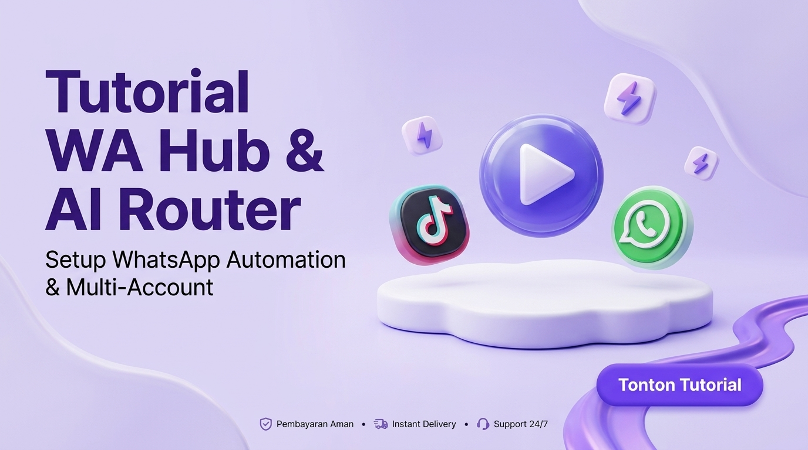

# Agentic Hub — AI Product & Tool Calling Engine

[](https://github.com/sodikinnaa/agentic-hub/actions/workflows/ci.yml)
[](LICENSE)
[](https://php.net)
[](docs/LYNK_ID_PRIVATE_ZOOM_SETUP.md)

Modul mandiri **Agentic AI Engine & Tool Calling System** untuk Laravel & Platform SaaS WakDondin Member.

---

## 🖼️ Visual Showcase & Lynk.id Assets

| 1:1 Lynk.id Square Thumbnail (1080x1080) | 16:9 Landscape Showcase Banner (1200x628) |
| :---: | :---: |
|  |  |

---

## 🚀 Fitur Utama Engine
- **AI Product Catalog & Pricing Engine**: Pengelolaan database produk, SKU, harga promo, dan link checkout direct.
- **Tool Calling / Function Calling API**: Memungkinkan AI Model (OpenAI, Gemini, DeepSeek) mengambil data produk & link checkout secara real-time tanpa halusinasi.
- **Multi-Role Scopes**: Pengaturan otoritas berjenjang dari CS Support (Level 1), Sales Closer (Level 2), Stock Manager (Level 3), hingga Super Copilot (Level 4).
- **WhatsApp Hub Integration**: Integrasi 2-way live chat real-time via Fonnte Gateway & Meta Cloud API Webhook.
- **Audit Logs & Latency Tracker**: Pencatatan riwayat Panggilan Tool, Status HTTP, dan latensi respon milidetik.

---

## 🎓 Lynk.id Media Kit & Service Showcase

| Item | Deskripsi | Link Berkas |
| --- | --- | --- |
| **🎓 Private 1-on-1 Zoom Setup Kit** | Paket copywriting, promo price (Rp 249K), syarat pre-zoom, & form checkout Lynk.id. | [Baca `LYNK_ID_PRIVATE_ZOOM_SETUP.md`](docs/LYNK_ID_PRIVATE_ZOOM_SETUP.md) |
| **🚀 WA Hub Product Launch Guide** | Panduan lengkap launching produk **WhatsApp Hub & Multi-CS System** (SKU: `WAHUB-PRO-01`). | [Baca `WA_HUB_PRODUCT_LAUNCH.md`](docs/WA_HUB_PRODUCT_LAUNCH.md) |
| **📚 Documentation Index** | Indeks seluruh berkas dokumentasi & asset showcase. | [Buka Folder `docs/`](docs/README.md) |

---

## 📐 Rekomendasi Ukuran Gambar Lynk.id

| Jenis Tampilan | Ukuran Rekomendasi | Rasio | Tautan Berkas Gambar |
| --- | --- | --- | --- |
| **Thumbnail Etalase Produk Lynk.id** | **1080 x 1080 px** | **1:1 (Persegi)** | [Download `private_zoom_setup_thumb_1x1.jpg`](docs/images/private_zoom_setup_thumb_1x1.jpg) |
| **Header Banner / Promotional Cover** | **1200 x 628 px** | **16:9 (Landscape)** | [Download `private_zoom_setup_banner.jpg`](docs/images/private_zoom_setup_banner.jpg) |

---

## 📽️ Content Kit TikTok (Tutorial Integrasi WA Hub -> Agentic Hub)



🎬 **Link Video TikTok**: [https://www.tiktok.com/@sodikin.tso/video/7668955156981157141](https://www.tiktok.com/@sodikin.tso/video/7668955156981157141)

### 📌 Judul Utama Video TikTok (Hook Teks Layar)
> **"Cara Hubungkan WhatsApp Hub ke Agentic AI Hub (Auto Tool Calling) 🚀"**

### 📝 Deskripsi / Caption TikTok (Koneksi Agentic AI Hub)
```text
Bikin AI WhatsApp Bot yang gak halusinasi harga & stok produk ternyata gampang banget guys! 🤯🤖

Tutorial koneksi WhatsApp Hub ke Agentic Hub di WakDondin Member:
1️⃣ Input produk & link checkout di Agentic AI Hub
2️⃣ Hubungkan API Key Agentic Hub ke modul WhatsApp Hub
3️⃣ AI otomatis panggil Tool Calling saat customer chat WA nanyain harga/link beli! 💬⚡

Gak ada lagi cerita AI ngasal kasih harga! 🚀

Cobain & akses sekarang di 👉 https://member.wakdondin.my.id ya! Ada kendala? Tulis di komentar 👇

#agenticai #whatsappbot #toolcalling #wakdondin #aiindonesia #laravel #webdevelopment #coding #saas #fyp
```

---

## 🧵 Threads Content Kit (Utas Yapping Original & Alami)

### 📌 Topik: "Kenapa Bot WA Jaman Now Masih Suka Halusinasi Harga & Solusi Tool Calling Engine"

#### 1/7 - The Hook
Pengalaman paling bikin elus dada sebagai dev: udah bikin AI Chatbot WhatsApp keren-keren, eh pas dipakai user malah halusinasi ngasih diskon 90% & ngobral stok barang ghaib 😭  

Dari situ gw sadar, kebanyakan bot WA jaman sekarang itu emang pinter ngobrol, tapi "buta" sama data asli toko.  

Ini cerita gimana gw ngebangun solusinya di **member.wakdondin.my.id**. 👇  
1/7

#### 2/7 - The Reality
Masalah bot WA biasa itu cuma disuapin prompt panjang:  
*"Kamu CS ramah, ini daftar 50 produk kami..."*  

Faktanya? LLM bakal lupa, ngarang harga pas ditanya varian rumit, atau ngasih link checkout yang gak valid.  

Ujung-ujungnya owner toko tetep harus turun tangan bales manual, atau pasrah rugi gara-gara AI-nya ngobral harga asal-asalan.  
2/7

#### 3/7 - Tool Calling Engine
Solusinya bukan bikin prompt yang makin panjang, tapi **mencabut hak AI buat ngebual**.  

Di modul **Agentic AI Hub**, AI-nya dilarang keras nebak harga/stok.  

Tiap ada chat masuk di WhatsApp:  
1. AI baca maksud pesan  
2. AI wajib nge-call Tool (`search_products`) ke database  
3. AI narik harga & link checkout resmi secara real-time  
3/7

#### 4/7 - Dashboard & Live Control
Biar gak lepas kendali, semua chat yang dihandle AI tetep masuk ke **Live Inbox (xChat UI)** di web dashboard.  

Jadi admin/owner bisa mantau dari layar laptop:  
🟢 Kalo AI-nya lancar, biarin running 24/7.  
🔴 Kalo ada chat spesifik yang butuh penanganan manusia, CS bisa langsung ambil alih (*take over*) sekali klik.  
4/7

#### 5/7 - Modular System
Sistem ini sengaja gw bikin modular di Laravel (pake Fonnte WA Gateway & Meta Cloud API):  

Kalo butuh WA Gateway-nya doang? Tinggal pake **WhatsApp Hub**.  
Kalo butuh AI engine-nya buat web lain? Tinggal pake **Agentic AI Hub** via REST API Key (`wakhub_live_sk_...`).  

Gak perlu sewa SaaS bulanan berjut-jut yang fiturnya dikunci-kunci.  
5/7

#### 6/7 - Versatile Use-Cases
Ternyata alur kayak gini gak cuma berguna buat olshop.  

Temen-temen yang punya bisnis jasa B2B, kelas online, agen properti, sampe klinik kecantikan bisa pake alur yang sama:  
Tinggal rapihin data produk/layanan di dashboard, hubungin token WA, beres.  
6/7

#### 7/7 - Closing & Link
Fitur ini udah live & bisa diklaim **Free Trial 1 Bulan** langsung di dashboard:  
👉 https://member.wakdondin.my.id  

📹 **Video demo & tutorial lengkapnya di TikTok:**  
🎬 Setup Fonnte WA: https://www.tiktok.com/@sodikin.tso/video/7668954448231697685  
🎬 Integrasi Agentic AI: https://www.tiktok.com/@sodikin.tso/video/7668955156981157141  

Kalo temen-temen dev atau solo founder ada yang lagi ngembangin fitur serupa & mau ngobrolin arsitekturnya, santai aja drop di reply ya! Let's yap! 🚀🔥  
7/7

---

## 🛠️ Lisensi
Distributed under the MIT License.
