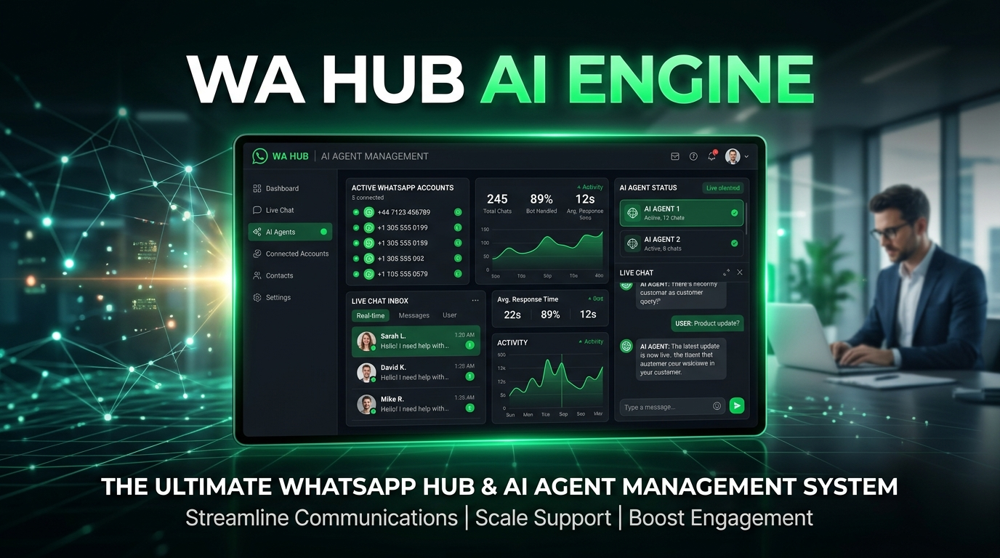

# 🚀 WhatsApp Hub & Multi-CS Live Chat System (WA Hub)

## 📌 Deskripsi Produk
**WhatsApp Hub & Multi-CS Live Chat System (WA Hub)** adalah modul SaaS dan gateway management system yang dirancang untuk mengintegrasikan layanan WhatsApp bisnis Anda ke dalam satu Dashboard terpusat. 

Dengan WA Hub, 1 nomor WhatsApp bisnis dapat dikelola oleh banyak Customer Service (CS) secara real-time tanpa khawatir bentrok atau perlu sewa tool terpisah yang mahal. Modul ini dilengkapi dengan fitur integrasi instant ke **Agentic AI Hub**, memungkinkan AI Customer Service / Sales Closing secara otomatis merespon calon pembeli, mengecek stok, memberikan promo, dan memberikan link checkout direct.

---

## 🔥 Fitur Unggulan (Key Features)

1. **Multi-Account & Multi-CS Live Inbox (Real-time)**
   - Akses live chat 2-arah terpusat dari Web Dashboard.
   - Manajemen multi-nomor WhatsApp dan pembagian tim CS secara efisien.

2. **Integrasi Gateway Fonnte & Meta Webhook**
   - Mendukung gateway Fonnte dan Meta Official Cloud API.
   - Pemasangan Webhook 1-klik untuk penerimaan & pengiriman pesan instan.

3. **Otomatisasi Agentic AI Hub (Tool Calling Engine)**
   - Terhubung langsung dengan Agentic AI CS (Level 1), Sales Closer (Level 2), Stock Manager (Level 3), & Super Copilot (Level 4).
   - AI dapat mengecek katalog produk, harga promo, stok, dan memberikan link checkout secara presisi dari database `agentic_products`.

4. **1-Click Copy Direct Checkout Link**
   - Link transaksi langsung yang siap disalin dan dikirimkan ke calon pelanggan.

5. **Monitoring Audit Logs & Latency**
   - Pencatat riwayat webhook, HTTP status, dan waktu respon dalam milidetik.

---

## 💰 Detail Paket & Lisensi Produk

| Parameter | Detail |
| --- | --- |
| **SKU Produk** | `WAHUB-PRO-01` |
| **Kategori** | Software / SaaS |
| **Harga Normal** | Rp 499.000 / bln |
| **Harga Promo Special Launching** | **Rp 249.000 / bln** 🔥 |
| **Status Stok** | `in_stock` (Siap Aktif) |
| **Link Pembelian / Checkout** | [Order WA Hub Direct](https://member.wakdondin.my.id/my-features/payment?feature=wa-hub) |

---

## 💻 Panduan Singkat Integrasi Agentic Hub
1. Masuk ke Dashboard Member [member.wakdondin.my.id/agentic-hub/ai-management?tab=products](https://member.wakdondin.my.id/agentic-hub/ai-management?tab=products).
2. Di Tab **Fase 2: Katalog Produk**, pastikan produk `WAHUB-PRO-01` sudah aktif.
3. Masuk ke Tab **Fase 8: Integrasi WhatsApp** untuk menyalin Webhook URL Agentic Engine.
4. Tempelkan Webhook URL ke Fonnte / Gateway WA Anda.
5. AI CS Agent akan otomatis memproses balasan live chat & sales closing secara 24/7! 🤖⚡
